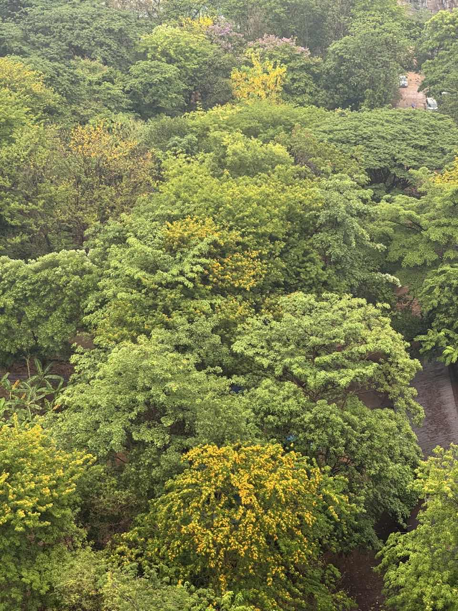

雨季彻彻底底地到来了，伴随一开始的几场大雨，缅甸花梨便开满了金黄的小花，满城都能看到。可惜花期特别短，这两天再往窗外和路上张望时，那些前几日挂满枝头的黄花全然不见了踪影，一夜突然出现，在雨中绽放后又悄然消失。

早上从GC到office的路上，在一个高架桥边的寺庙外，可以看到一棵开满粉色花儿的树。那种浅浅的粉色挂在枝头，与嫩绿色的叶子交相辉映，藏匿于建筑之间。独此一处粉饰着清新的颜色，惹人欢喜，让我觉得不远处大金塔的富贵之气也不过如此。

这周似乎依然浑浑噩噩的，心情也像被霏霏淫雨所打湿，情绪有一点Down。在这样平凡的日子里，有点渴望去做些不一样的事情，想去哪里完完全全地关机重启一下，但依然还需要等待一下。无论如何，时间不会停下，这样真真切切的时间依然要学会珍惜和如何度过。所以，多多写下一点东西，留下那么些许的痕迹吧。要坚持学习与成长呀，bro。

欸，不过最近学会了用火锅底料煮面条，吃起来还不错。不过还能继续优化改进咧，下次先把卖相做好点。

